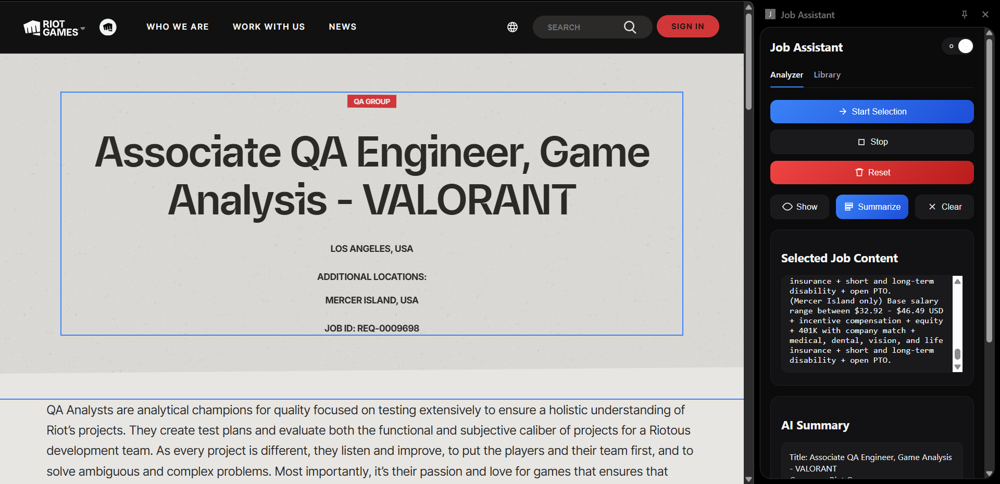
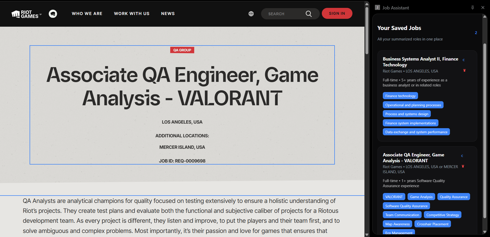

# Job Assistant – AI Powered Job Listing Analyzer

Job Assistant is a Chrome extension that helps users analyze, summarize, and organize job listings using AI.

Instead of manually reading long job descriptions, users can select job content directly from a webpage, generate an AI structured summary, and save the job into a personal library for later review.

The project uses a Groq LLM backend, a Node.js API, and a Chrome Extension side panel UI to provide a fast workflow for job seekers.

---

## Features

### AI Job Summary

Users can select text from any job listing page and generate a structured summary including:

- Job Title
- Company
- Location
- Job Type
- Required Experience
- Skills
- Technical Stack
- AI generated summary

This removes the need to manually read long job descriptions.

---

### Save Jobs to Personal Library

Users can save job summaries into a local job library stored in:

```text
chrome.storage.local
```

Each saved job includes:

- Structured job data
- Job URL
- Save timestamp

The library allows quick reference to previously analyzed roles.

---

### Duplicate Job Detection

The extension prevents duplicate entries by checking the job URL before saving.

If the same job has already been saved, the extension prevents duplicate entries.

---

### Drag & Reorder Saved Jobs

Users can reorder their saved jobs using drag-and-drop.

This is powered by:

```text
SortableJS
```

The new order persists automatically in Chrome storage.

---

### Light / Dark Theme

The extension includes a theme toggle with:

- Light mode
- Dark mode

The preference is saved using:

```text
chrome.storage.local
```

---

### Chrome Side Panel UI

The extension runs inside the Chrome Side Panel to create a clean workflow:

```text
Job Page → Select Content → Analyze → Save
```

This avoids switching tabs and keeps the process fast.

---

## Project Structure

```text
job-assistant
│
├── backend
│
├── extension
│
└── README.md
```

---

## Backend Architecture

The backend is responsible for:

- AI summarization
- Prompt formatting
- Structured job data extraction

It exposes a single API endpoint.

### Endpoint

```http
POST /summarize
```

Input:

```json
{
  "jobText": "Job description text"
}
```

Output:

```json
{
  "title": "",
  "company": "",
  "summary": "",
  "skills": [],
  "tech_stack": [],
  "experience_required": "",
  "location": "",
  "job_type": ""
}
```

---

## Backend Technologies

- Node.js
- Express
- Axios
- Groq LLM API
- Zod (schema validation)
- Redis (optional caching)

---

## Extension Architecture

```text
extension
│
├── sidepanel
│   ├── sidepanel.html
│   ├── sidepanel.css
│   └── sidepanel.js
│
├── modules
│   ├── analyzer.js
│   ├── library.js
│   ├── storage.js
│   ├── messaging.js
│   └── theme.js
│
├── contentScript.js
│
├── libs
│   └── Sortable.min.js
│
└── manifest.json
```

---

## Key Modules

### analyzer.js

---


---

Handles:

- Selection mode
- Fetching selected job content
- Calling the backend API
- Rendering AI summaries
- Saving jobs

---

### library.js

---


---

Handles:

- Rendering saved jobs
- Drag and reorder functionality
- Opening job links
- Deleting saved jobs

---

### storage.js

Wrapper around Chrome storage.

Used for storing and retrieving saved job data.

---

### messaging.js

Handles communication between:

```text
Sidepanel ↔ Content Script
```

Used to trigger actions like:

- startSelection
- stopSelection
- clearSelection
- getSelection

---

### contentScript.js

Injected into webpages.

Responsible for:

- detecting selected job content
- returning selected text
- enabling selection mode

---

## AI Workflow

```text
User selects job text
↓
Sidepanel sends text to backend
↓
Backend calls Groq LLM
↓
LLM extracts structured job data
↓
Backend validates response
↓
Extension displays summary
```

---

## Setup Guide

### 1. Clone Repository

```bash
git clone https://github.com/your-repo/job-assistant.git
cd job-assistant
```

---

### 2. Setup Backend

Navigate to the backend folder:

```bash
cd backend
```

Install dependencies:

```bash
npm install
```

Create a `.env` file:

```env
GROQ_API_KEY=your_groq_api_key
PORT=5000
```

Start the backend server:

```bash
node index.js
```

The server will run at:

```text
http://localhost:5000
```

---

### 3. Load Chrome Extension

1. Open Chrome
2. Navigate to:

```text
chrome://extensions
```

1. Enable **Developer Mode**
2. Click **Load Unpacked**
3. Select the extension folder:

```text
extension/
```

---

### 4. Use the Extension

Open any job listing page and follow this workflow:

```text
Start Selection
↓
Highlight job description
↓
Click Summarize
↓
Review AI summary
↓
Save to Library
```

---

## Example Workflow

1. Open a LinkedIn job listing
2. Click **Start Selection**
3. Highlight the job description
4. Click **Summarize**
5. Review the AI generated summary
6. Save the job to the library

---

## Future Improvements

### AI Features

- Skill match scoring
- Resume bullet generator
- Interview question generator
- Job fit analysis
- Salary estimation
- Career insights

---

### Backend Improvements

- Embedding-based job deduplication
- Redis caching layer
- Streaming AI responses
- Batch job analysis

---

### Extension Improvements

- Search saved jobs
- Tagging system
- Export saved jobs
- Notion integration
- Resume matching
- Auto detection of job pages

---

## Performance Considerations

To ensure fast responses:

- Groq LLM API provides low latency inference
- Redis caching prevents repeated summarization calls
- Structured prompts reduce token usage

---

## Security Considerations

- API keys are stored only in backend `.env`
- The extension communicates only with the local backend
- Chrome storage is used for local persistence

---

## License

MIT License

---

## Author

Created to explore:

- Chrome Extension development
- LLM integration
- AI assisted productivity tools
- Full stack application architecture
